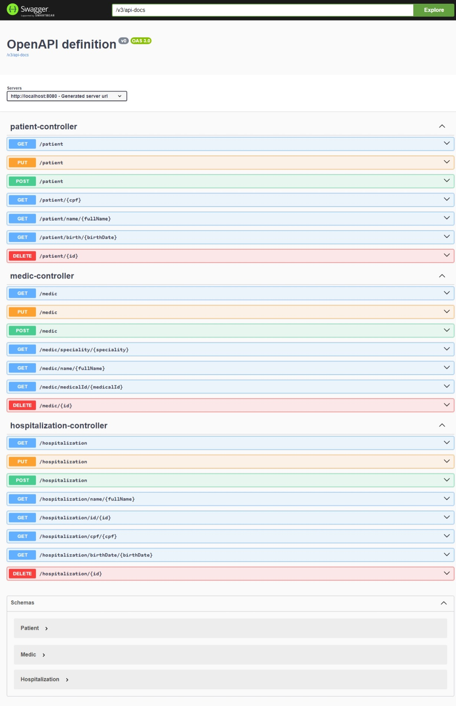

# Sistema de internação hospitalar

## API REST de internação hospitalar

### Índice
* [Preview](#Preview)
* [Tecnologias](#Tecnologias)
* [Como usar](#Como-usar)

## Preview

## Tecnologias

- Spring Boot 3
- Maven
- Spring Web
- Spring JPA
- MYSQL
- Bean Validation
- Springdoc
- Git e GitHub

## Como usar

Basta configurar o seu banco de dados e rodar a aplicação. 
Para acessar a documentação do swagger, bastar acessar http://localhost:8080/swagger-ui/index.html
